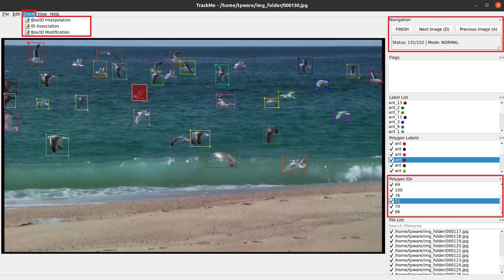

<h4 align="center">
  TrackMe
</h4>

<h4 align="center">
  Simple Tracking Annotation Tool based on LabelMe
</h4>

## Description
This tool is built to integrate tracking visualization and annotation capabilities into LabelMe. <br>
Please feel free to use if your project/work includes visualization of multi-object tracking and editting of object information. <br>
TrackMe annotation format is compatible with LabelMe annotation format (.json) without conversion.

 <br>
<i>TrackMe saves and displays the tracking information of multiple objects on the right. It generates unique colors for different combinations of object label and ID  </i>

## Features
- Add/remove tracking ID.
- Associate boxes (assign IDs) for existing non-ID detection boxes in the video folder (SORT).
- Interpolate boxes in long video range in case no pre-defined detection boxes.
- Modify/Delete boxes of same info throughout a list of continuous frames.
- Display homegeneous color for same object info (for the sake of multi-view object tracking).

## Installation
Please install Anaconda environment on your computer beforehand.

conda create --name=trackGUI python=3.8 <br>
conda activate trackGUI <br>
pip install -e . <br>

## Usage
conda activate trackGUI <br>
labelme

## Note
All frames must have labeled boxes
+ Track from scratch: track from the first frame to the end frame with automatic ID assignment
+ Track from Current Frame w/ Annotation: track from the current (being opened) frame with the modified ID or manual ID assignment
+ Track from Current Frame w/0 Annotation: track from the current (being opened) frame with automatic ID assignment

## Citation
If you find our work helpful, please consider citing our paper:
```
@misc{phan2024trackmeasimpleeffectivemultiple,
      title={TrackMe:A Simple and Effective Multiple Object Tracking Annotation Tool}, 
      author={Thinh Phan and Isaac Phillips and Andrew Lockett and Michael T. Kidd and Ngan Le},
      year={2024},
      eprint={2410.15518},
      archivePrefix={arXiv},
      primaryClass={cs.CV},
      url={https://arxiv.org/abs/2410.15518}, 
}
```
